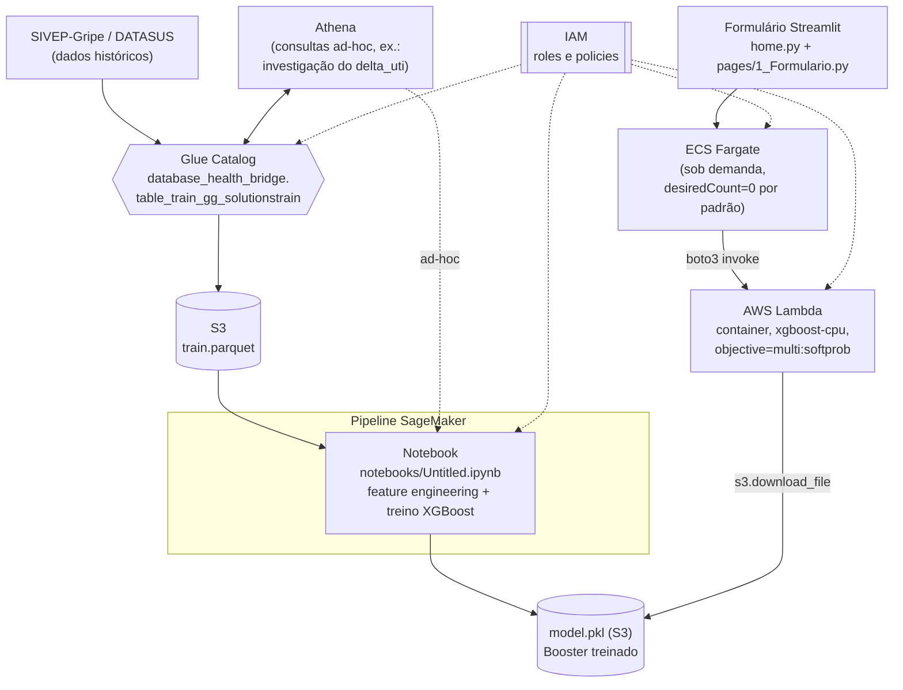

# Classificador de Síndrome Respiratória Aguda Grave (SRAG/COVID-19)

Frontend em Streamlit que consulta um modelo **XGBoost multiclasse**, treinado
sobre dados do **SIVEP-Gripe** (Sistema de Informação da Vigilância
Epidemiológica da Gripe, DATASUS), para sugerir a classificação final
(`classi_fin`) de um caso notificado de Síndrome Respiratória Aguda Grave a
partir de dados clínicos e de atendimento.

## Destaque do projeto (modelo STAR)

**Situação**: o DATASUS disponibiliza publicamente os dados do SIVEP-Gripe
(notificações de Síndrome Respiratória Aguda Grave), mas a conta AWS usada
neste projeto não tinha cota para instâncias `ml.*` do SageMaker — o caminho
"padrão" de treinar/servir via SageMaker Estimator/Endpoint gerenciado estava
descartado.

**Tarefa**: construir, do zero, um classificador multiclasse (5 classes de
`classi_fin`) com uma aplicação usável ponta a ponta — treino, empacotamento
do modelo, serviço de inferência e frontend — hospedada na AWS, gastando o
mínimo possível de recurso, já que é um projeto de portfólio sem tráfego
constante.

**Ação**:
- Engenharia de features (faixa etária, score de comorbidades, macro-região,
  sazonalidade via seno/cosseno da semana epidemiológica, score vacinal) e
  treino de um XGBoost nativo (early stopping, pesos de amostra balanceados)
  direto no notebook, sem depender do Estimator gerenciado do SageMaker.
- Contornei a falta de cota de endpoint gerenciado empacotando o modelo
  (`pickle`) e servindo via uma AWS Lambda em container (Docker + ECR), com o
  `objective` ajustado para `multi:softprob` **sem retreino** para expor a
  confiança por classe, não só o rótulo vencedor.
- Investiguei a procedência de uma feature crítica não documentada
  oficialmente (`delta_uti`, a de maior peso no modelo treinado) cruzando o
  dicionário oficial de dados do SIVEP-Gripe, o catálogo Glue/Athena da
  tabela de origem e uma consulta agregada no Athena — documentando a
  limitação encontrada em vez de ocultá-la.
- Construí um frontend Streamlit (página de apresentação + formulário) que
  invoca a Lambda via `boto3`, containerizei com Docker e implantei em ECS
  Fargate.
- Reduzi o custo de infraestrutura a zero quando ocioso: o serviço fica com
  `desiredCount=0` por padrão, com scripts de start/stop e uma Lambda de
  auto-stop (via EventBridge) que desliga o serviço automaticamente após um
  limite de tempo de uptime.
- Revisei o código com um agente independente antes de ir para produção,
  corrigindo dependências não usadas e uma imagem-base desatualizada no
  Dockerfile.

**Resultado**: modelo com **68% de acurácia** e **F1 ponderado de 0.67** no
conjunto de teste (nunca visto durante o treino/early stopping); pipeline
completo em produção na AWS (Streamlit → Lambda → XGBoost) com custo de
infraestrutura efetivamente zero quando não está em uso; limitações
conhecidas documentadas de forma transparente em vez de escondidas.

## Arquitetura



- A tabela de origem (`database_health_bridge.table_train_gg_solutionstrain`,
  Glue Catalog) é o dado histórico do SIVEP-Gripe já catalogado; o Athena é
  usado tanto para materializar o `train.parquet` consumido pelo notebook
  quanto para consultas ad-hoc de investigação (ex.: a distribuição do
  `delta_uti`, ver ressalva abaixo).
- O treino (split, feature engineering, XGBoost, avaliação) roda inteiramente
  no notebook `notebooks/Untitled.ipynb` (fonte da verdade, espelha o que
  roda no SageMaker) e persiste o modelo via `pickle`.
- A inferência não usa SageMaker Endpoint (conta sem cota para instâncias
  `ml.*`): o Streamlit invoca diretamente uma função Lambda via `boto3`, que
  carrega o `model.pkl` do S3 e roda `booster.predict`.
- O modelo usa `objective='multi:softprob'`, retornando a probabilidade das 5
  classes por caso (não apenas o rótulo vencedor).
- O Streamlit roda em ECS Fargate sob demanda (ver seção "Deploy" abaixo),
  não como servidor sempre ligado.

## Rodando localmente

```bash
pip install -r requirements.txt
streamlit run home.py
```

Requer credenciais AWS configuradas (`~/.aws/credentials`) com permissão de
`lambda:InvokeFunction` na função configurada em `LAMBDA_FUNCTION_NAME`
(variável de ambiente, default `requisicoes_ml_sagemaker`).

## Docker

```bash
docker build -t respiratory-diseases-app .
docker run -p 8501:8501 -v ~/.aws:/root/.aws:ro respiratory-diseases-app
```

## Deploy (ECS Fargate) — liga sob demanda

O app roda em um serviço ECS Fargate (`respiratory-diseases-cluster` /
`respiratory-diseases-task-service-l0kgkxxb`), mas **fica parado por padrão**
(`desiredCount=0`) para não gerar custo continuo — é um projeto de
portfólio, sem tráfego constante.

- **Ligar**: `scripts/iniciar_app.sh` — sobe o serviço, espera a task ficar
  saudável e imprime o link público (IP direto, sem load balancer — muda a
  cada start).
- **Desligar na hora**: `scripts/parar_app.sh`.
- **Auto-stop**: uma função Lambda (`respiratory-diseases-auto-stop`),
  disparada a cada 10 minutos por uma regra do EventBridge, derruba o
  serviço automaticamente depois de 2h de uptime (`MAX_UPTIME_MINUTES`, env
  var da Lambda) — não é detecção de tráfego (o serviço não tem load
  balancer para medir requisições), é um limite de tempo de sessão. Ambos os
  scripts e a Lambda usam apenas `ecs:UpdateService` na task definition e no
  serviço já existentes; nenhuma outra configuração (porta, imagem, roles do
  container) muda.

## Ressalva conhecida: `delta_uti`

`delta_uti` é a feature de **maior peso** no modelo treinado (maior
`gain`/`total_gain`/`cover` das 11 features usadas), mas o nome não existe no
dicionário oficial de dados do SIVEP-Gripe (conferido no PDF oficial de
19/09/2022, opendatasus.saude.gov.br). A leitura de trabalho da equipe é que
se trata de um valor calculado a partir dos campos oficiais **54 - Data de
entrada na UTI** (`DT_ENTUTI`) e **55 - Data de saída da UTI** (`DT_SAIDUTI`)
— consistente com a distribuição observada dos valores (via consulta Athena),
mas **não é uma definição publicada pelo DATASUS** com esse nome. Antes de
usar este modelo em um contexto clínico real, vale confirmar a definição
exata com quem construiu o pipeline de dados de origem.

## Estrutura do repositório

- `home.py` — página inicial: visão geral do projeto e dicionário de campos.
- `pages/1_Formulario.py` — formulário de entrada e exibição da previsão.
- `common.py` — constantes e lógica compartilhada (mapeamento de labels,
  cálculo de features derivadas, invocação da Lambda).
- `notebooks/Untitled.ipynb` — notebook de treino (fonte da verdade).
- `assets/` — ficha oficial de notificação do SIVEP-Gripe (PDF), usada como
  referência para os códigos dos campos do formulário.
